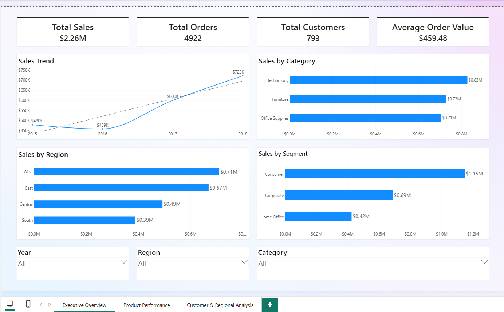
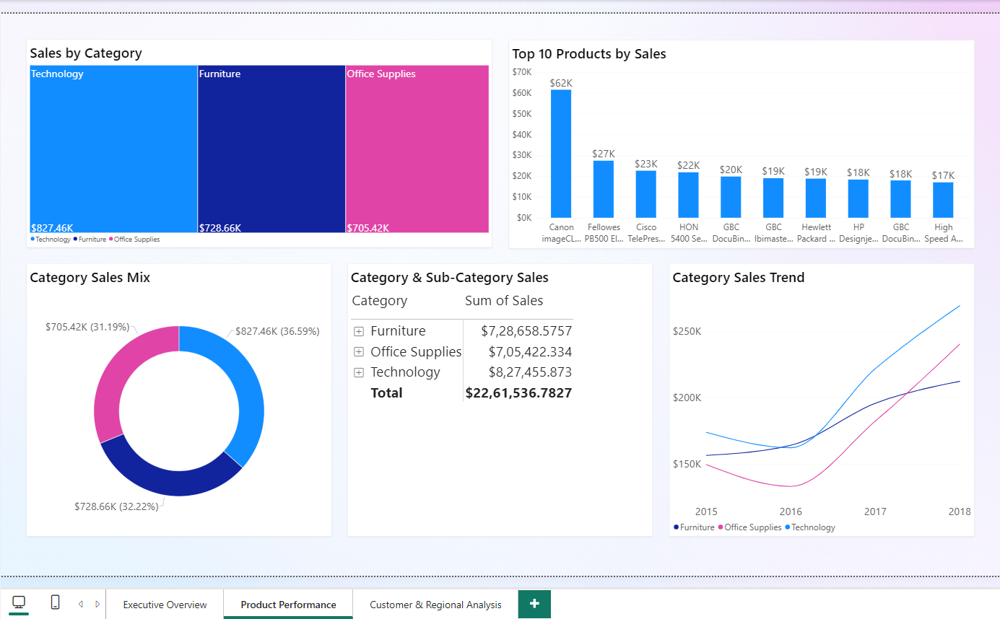
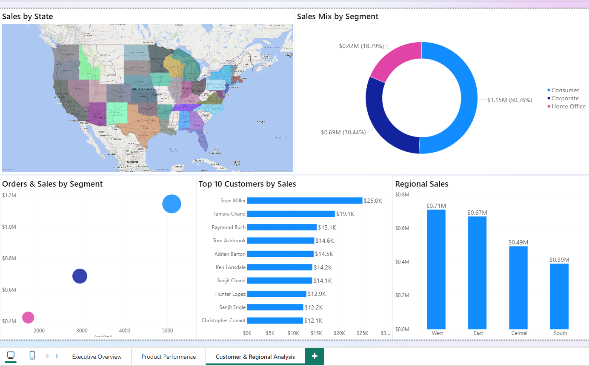

# Retail Sales Analytics

An end-to-end business analytics project that takes a raw Superstore transaction file and turns it into an interactive Power BI report covering sales performance, products, customers, and regional trends.

The workflow spans data cleaning and exploratory analysis in **Python**, business analysis in **SQL**, and dashboard development in **Power BI**.

---

## Table of Contents

- [Overview](#overview)
- [Dataset](#dataset)
- [Tools & Technologies](#tools--technologies)
- [Project Workflow](#project-workflow)
- [Data Preparation](#data-preparation)
- [Business KPIs](#business-kpis)
- [Power BI Dashboard](#power-bi-dashboard)
- [Key Business Findings](#key-business-findings)
- [Business Recommendations](#business-recommendations)
- [Business Questions Addressed](#business-questions-addressed)
- [SQL Analysis](#sql-analysis)
- [Power BI Features Used](#power-bi-features-used)
- [Project Structure](#project-structure)
- [How to Reproduce](#how-to-reproduce)
- [Skills Demonstrated](#skills-demonstrated)
- [Outcome](#outcome)

---

## Overview

The analysis covers:

- Category and sub-category performance
- Regional performance
- Customer segments
- Top-performing products
- Top customers
- Customer and order metrics
- Geographic sales distribution

The final output is an interactive Power BI report that lets business users filter and explore the data dynamically rather than reading static summaries.

---

## Dataset

A Superstore retail dataset containing roughly:

- **9,800 transaction rows** (order line items)
- **18 columns**
- Order and shipping details
- Customer details
- Geographic details
- Product, category, and sub-category details
- Sales values

### Key Columns

| Column | Description |
|---|---|
| `Order ID` | Unique order identifier |
| `Order Date` | Date the order was placed |
| `Ship Date` | Date the order was shipped |
| `Ship Mode` | Shipping method |
| `Customer ID` | Unique customer identifier |
| `Customer Name` | Customer name |
| `Segment` | Customer segment |
| `City` | Customer city |
| `State` | Customer state |
| `Region` | Geographic region |
| `Product ID` | Product identifier |
| `Product Name` | Product name |
| `Category` | Product category |
| `Sub-Category` | Product sub-category |
| `Sales` | Sales value of the transaction |

---

## Tools & Technologies

| Layer | Stack |
|---|---|
| Data cleaning & EDA | Python — pandas, NumPy, Matplotlib |
| Business analysis | SQL — aggregation, filtering, subqueries, CTEs, window functions |
| Reporting | Power BI — Power Query, DAX measures, slicers, interactive visuals |

---

## Project Workflow

```text
Raw Dataset
     ↓
Data Cleaning & Preparation
     ↓
Exploratory Data Analysis
     ↓
Business KPI Analysis
     ↓
SQL Business Analysis
     ↓
Power BI Data Model
     ↓
Interactive Dashboard
     ↓
Business Insights
```

---

## Data Preparation

The dataset was inspected and prepared before analysis:

- Inspected dataset structure and data types
- Handled missing and invalid values
- Converted date columns to proper date formats
- Validated numerical columns
- Removed data inconsistencies
- Shaped the dataset for analytical queries and visualisation

Power Query handled additional shaping inside Power BI on top of the Python cleaning step.

---

## Business KPIs

| KPI | Value |
|---|---|
| Total Sales | $2.26M |
| Total Orders | 4,922 |
| Total Customers | 793 |
| Average Order Value | $459.48 |

> Orders are counted on distinct `Order ID`, which is lower than the row count because a single order can contain multiple line items.

---

## Power BI Dashboard

The report is split across three analytical pages.

### 1. Executive Overview

A high-level summary built for management-level review and quick trend spotting.

Includes:

- Total Sales, Total Orders, Total Customers, Average Order Value
- Sales trend over time
- Sales by Category
- Sales by Region
- Sales by Segment

**Filters:** Year · Region · Category

### 2. Product Performance

Focuses on which products and categories drive revenue.

Includes:

- Sales by Category
- Top 10 Products by Sales
- Category Sales Mix
- Category & Sub-Category Sales
- Category Sales Trend

### 3. Customer & Regional Analysis

Focuses on customer contribution and geographic performance.

Includes:

- Sales by State
- Sales Mix by Segment
- Orders & Sales by Segment
- Top 10 Customers by Sales
- Regional Sales

---

## Key Business Findings

### Sales Growth

Sales grew from approximately **$459K in 2016 to $722K in 2018**, a strong expansion in the latter part of the period.

| Year | Sales |
|---|---|
| 2015 | ~$480K |
| 2016 | ~$459K |
| 2017 | ~$600K |
| 2018 | ~$722K |

### Category Performance

| Category | Sales | Share of Total |
|---|---|---|
| Technology | ~$827K | ~36.6% |
| Furniture | ~$729K | ~32.3% |
| Office Supplies | ~$705K | ~31.2% |

Technology led, but revenue is spread fairly evenly across all three categories — the business is not dependent on any single one.

### Regional Performance

| Region | Sales |
|---|---|
| West | ~$710K |
| East | ~$670K |
| Central | *(fill in from report)* |
| South | ~$390K |

The West led and the South was the weakest region by a wide margin.

### Customer Segments

| Segment | Sales | Share of Total |
|---|---|---|
| Consumer | ~$1.15M | ~51% |
| Corporate | ~$0.69M | ~30% |
| Home Office | ~$0.42M | ~19% |

Consumer alone accounts for more than half of total sales.

### Product Performance

The highest-selling individual product was the **Canon imageCLASS 2200 Advanced Copier** at approximately **$62K**. A small number of products generate disproportionately high sales relative to the rest of the portfolio.

### Customer Performance

The highest-value customer identified was **Sean Miller** at approximately **$25K** in sales.

---

## Business Recommendations

- Investigate the reasons behind weaker South-region performance.
- Continue monitoring Technology category demand.
- Prioritise inventory planning for high-performing products.
- Develop retention strategies for high-value customers.
- Analyse the factors responsible for the strong sales growth after 2016.
- Explore segment-specific strategies for Corporate and Home Office customers.

---

## Business Questions Addressed

- What are the overall sales and order KPIs?
- How are sales changing over time?
- Which category generates the most revenue?
- Which sub-categories contribute the most sales?
- Which region generates the highest sales?
- Which customer segment contributes the most revenue?
- Which products generate the highest sales?
- Who are the highest-value customers?
- How are sales distributed geographically?
- How does category performance change over time?

---

## SQL Analysis

`sql/business_analysis.sql` contains the structured business analysis behind the figures above — customer-level, product-level, regional, and category views.

Techniques used include aggregation and `GROUP BY`, filtering with `WHERE`, group filtering with `HAVING`, sorting and ranking, subqueries, CTEs, and window functions for ranking and period comparisons.

Outputs included top customers, top products, highest-selling categories, regional sales, customer order behaviour, and sales trends over time.

> The dataset is a single flat table, so the SQL layer is aggregation- and window-function-driven rather than join-heavy.

---

## Power BI Features Used

- KPI cards
- Line charts
- Bar charts
- Donut charts
- Treemaps
- Matrix / table visuals
- Geographic map
- Slicers
- DAX measures
- Cross-visual interactive filtering

Users can filter the report by **Year**, **Region**, and **Category**.

---

## Project Structure

```text
retail-sales-analytics/
│
├── data/
│   └── superstore.csv
│
├── notebooks/
│   └── retail_sales_analysis.ipynb
│
├── sql/
│   └── business_analysis.sql
│
├── powerbi/
│   └── retail_sales_dashboard.pbix
│
├── insights/
│   └── business_insights.md
│
├── screenshots/
│   ├── executive_overview.png
│   ├── product_performance.png
│   └── customer_regional_analysis.png
│
├── README.md
└── .gitignore
```

---

## How to Reproduce

1. Clone the repository.
2. Install Python dependencies:
   ```bash
   pip install pandas numpy matplotlib jupyter
   ```
3. Run the notebook to reproduce cleaning and exploratory analysis:
   ```bash
   jupyter notebook notebooks/retail_sales_analysis.ipynb
   ```
4. Load `data/superstore.csv` into any SQL engine and run `sql/business_analysis.sql`.
5. Open `powerbi/retail_sales_dashboard.pbix` in Power BI Desktop and update the data source path before refreshing.

---

## Dashboard Preview

**Executive Overview**



**Product Performance**



**Customer & Regional Analysis**



---

## Skills Demonstrated

**Data Analysis**

- Data cleaning
- Exploratory analysis
- KPI development
- Business question formulation
- Trend analysis
- Customer and product analysis

**SQL**

- Aggregation
- Filtering
- Subqueries
- CTEs
- Window functions
- Ranking
- Time-based analysis

**Power BI**

- Data modelling
- Power Query
- DAX measures
- KPI cards
- Interactive filters
- Dashboard design
- Business visualisation

---

## Outcome

This project demonstrates an end-to-end Business/Data Analyst workflow, from raw transactional data through SQL analysis to an interactive Power BI dashboard.

The final dashboard lets business users quickly identify sales trends, high-performing categories and products, valuable customers, segment contribution, and regional performance.
